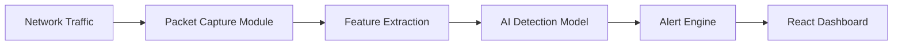

# 🛡️ XENO SHIELD - Alien Intrusion Detection System

<p align="center">
  
  
  
  
</p>

## 📖 Project Overview

**XENO SHIELD** is a Level 3 Industrial Project: an AI-powered Intrusion Detection System (IDS) designed to monitor, analyze, and detect suspicious network activities in real-time. The system uses a futuristic, alien-themed interface to visualize cyber threats as unknown extraterrestrial signals. This project combines cybersecurity concepts, artificial intelligence, and modern web technologies to create a professional-grade, highly engaging security dashboard.

---

## ✨ Core Features

- 📡 **Real-time Packet Monitoring**: Captures and analyzes network traffic continuously.
- 🧠 **AI-based Anomaly Detection**: Employs Machine Learning models to identify unusual traffic patterns.
- 🚨 **Threat Level Indicator**: Automatically classifies threats (Low / Medium / High / Critical).
- 📊 **Live Dashboard with Graphs**: Intuitive data visualization of real-time network states.
- 🔔 **Alert Notification System**: Instant feedback when suspicious activity is detected.
- 🗄️ **Attack Logs & History**: Persistent logging for forensic and threat analysis.
- 🌐 **Suspicious IP Tracking**: Monitors and flags potential bad actors.
- 🛸 **Radar Visualization Interface**: A unique, alien-themed radar screen for engaging visualization.

---

## 🛠️ Tech Stack

### **Frontend**
- **React.js** with **TypeScript**: For building robust, scalable user interfaces.
- **Tailwind CSS**: For futuristic, custom, and responsive styling.
- **Recharts / Chart.js**: For rendering dynamic traffic graphs and meters.
- **Framer Motion**: For smooth micro-interactions and complex UI animations.

### **Backend**
- **Python (FastAPI)**: High-performance, asynchronous API.
- **Scapy**: For robust packet sniffing and network manipulation.
- **Scikit-learn**: Core ML library powering the AI anomaly detection models.

### **Database**
- **MongoDB / PostgreSQL**: (Depending on deployment) For storing logs, threat history, and user data.

---

## 🏗️ System Architecture

The architecture follows a decoupled, real-time data pipeline flow:



---

## 🤖 AI Model Details

XENO SHIELD utilizes sophisticated Machine Learning algorithms to categorize and identify threats.

**Algorithms Suggested/Implemented:**
- **Isolation Forest**: Primarily for Anomaly Detection (identifying outliers in network traffic).
- **Random Forest**: For classifying specific types of known threats.
- **K-Means Clustering**: For behavior clustering and finding unknown threat patterns.

**Training Data Sources:**
- Normal Traffic Patterns
- Simulated Attack Traffic
- Port Scans
- DDoS Simulation Data

---

## 📂 Folder Structure

```text
xeno-shield/
│
├── frontend/             # React/TypeScript frontend application
│   ├── src/
│   │   ├── components/   # Reusable UI components (Meters, Radars, Graphs)
│   │   ├── pages/        # Dashboard, Logs, Settings views
│   │   └── services/     # API interaction layers
│   └── package.json
│
├── backend/              # FastAPI Python backend
│   ├── main.py           # API entry point
│   ├── packet_sniffer.py # Network capture logic
│   ├── model/            # Trained AI models & scalers
│   ├── requirements.txt  # Python dependencies
│   └── utils/            # Helper functions
│
├── database/             # Database schemas and seed data
├── docs/                 # Extended documentation
└── README.md             # Project overview
```

---

## 💻 Dashboard Modules

1. **Threat Meter**: Visual gauge of current network danger level.
2. **Traffic Graph**: Live line/bar charts of incoming vs. outgoing packets.
3. **Alert Console**: A terminal-like feed of recent alerts and system events.
4. **Network Statistics Panel**: Detailed breakdown of packet types (TCP, UDP, ICMP).
5. **Attack Radar Screen**: An interactive, animated radar pinging incoming IPs.

---

## 🚀 Setup & Installation

*(Prerequisites: Node.js, Python 3.8+, pip, and npm)*

### 1. Clone the Repository
```bash
git clone https://github.com/yourusername/xeno-shield.git
cd xeno-shield
```

### 2. Backend Setup
```bash
cd backend
python -m venv venv
# Activate virtual environment
# Windows:
venv\Scripts\activate
# Mac/Linux:
# source venv/bin/activate

pip install -r requirements.txt
python main.py
```
*Note: Packet sniffing (like Scapy) may require running with Administrator/Root privileges.*

### 3. Frontend Setup
```bash
cd frontend
npm install
npm run dev
```

---

## 🔮 Future Enhancements

- **Deep Learning Integration**: Implementing neural networks (LSTMs) for time-series traffic prediction.
- **Role-based Authentication**: Admin, Analyst, and Viewer tiers.
- **Cloud Deployment**: Containerizing with Docker and deploying via AWS/Azure.
- **Multi-device Monitoring**: Scaling to monitor multiple nodes in a network simultaneously.
- **Global Attack Visualization Map**: A 3D interactive globe showing attack origins.

---

## 🎯 Resume Value

This project provides significant value for a technical portfolio, demonstrating:
- **Cybersecurity Knowledge**: Understanding network packets, anomalies, and common attack vectors.
- **AI Integration Skills**: Bridging machine learning with real-world applications.
- **Real-time System Design**: Managing continuous data streams.
- **Full-Stack Development**: Creating a seamless bridge between a Python data pipeline and a React UI.
- **Data Analysis Capabilities**: Parsing, feature-extracting, and visualizing complex datasets.

---

<p align="center">
  <i>"XENO SHIELD is an AI-driven intrusion detection system that monitors network traffic, identifies anomalies, and alerts users about potential cyber threats through a futuristic real-time dashboard."</i>
</p>
